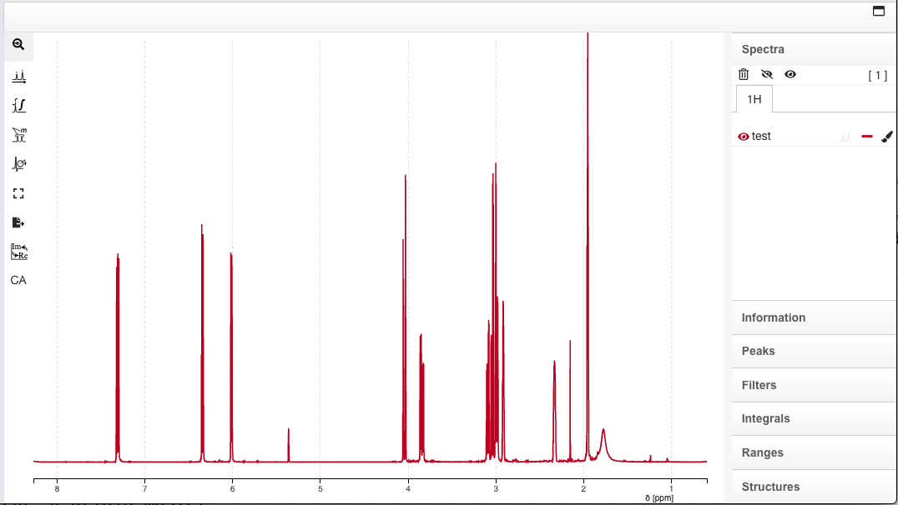

# NMRium : display and process NMR spectra

## User manual

The software "NMR Displayer" allows NMR users to import their NMR spectra, process the raw spectra, and edit the spectra.

- Processing
  - [Preprocessing](processing/preprocessing/README.md)
  - [FFT](processing/fft/README.md)